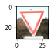
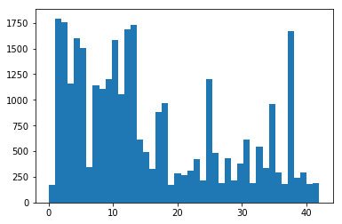
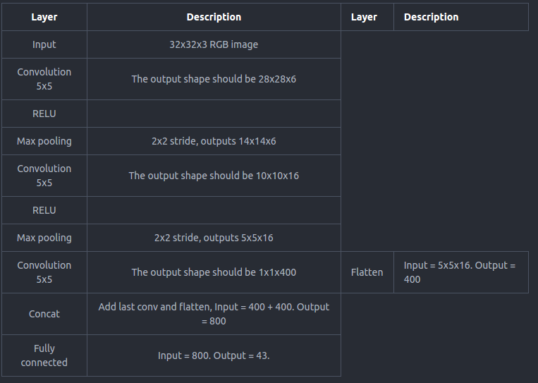

# **Traffic Sign Recognition**

---
### Writeup


link to my [project code](https://github.com/redheli/CarND-Traffic-Sign-Classifier-Project/blob/master/Traffic_Sign_Classifier.ipynb)

### Data Set Summary & Exploration

#### Train and test dataset download from http://benchmark.ini.rub.de/?section=gtsrb&subsection=dataset

signs data set:

* The size of training set is 31367
* The size of the validation set is 7842
* The size of test set is 12630
* The shape of a traffic sign image is not 32x32x3
* The number of unique classes/labels in the data set is 43

I use pillow to resize the images to 32x32x3

#### visualization of the dataset.

Yield


histogram for the distribution



### Design and Test a Model Architecture

#### 1. Normalizes the data between 0.1 and 0.9 instead of 0 to 255

```
def normalize(data):
    return data / 255 * 0.8 + 0.1
```

I normalized the image data because it makes training easy.

I did not grayscale the images, as color is important feature.


#### 2. final model architecture

My final model consisted of the following layers:




#### 3. Train model

To train the model, I used tensorflow AdamOptimizer,learning rate 0.0009, EPOCHS = 30
BATCH_SIZE = 256.


#### 4. Increase the epochs, I get better training accuracy 0.99.
Of course I modified the model layer to from original LeNet-5 to currenr structure.


My final model results were:
* training set accuracy of 0.999
* validation set accuracy of 0.93
* test set accuracy of 0.942

What was the first architecture that was tried and why was it chosen?

ans: my first model is LeNet-5 , as it is already implemented in the course. at begining, I think it maybe a base model for my architecture.


What were some problems with the initial architecture?

ans: the valid accuracy is only 0.83 , even I tune the learning rate and batch size, Increase epochs number.
I realize LeNet-5 maybe not suit for the task, it may design for large input images.


How was the architecture adjusted and why was it adjusted?

ans: 1) reduce the FC layer, as I think for our small image (32x32) , it maybe enough.
2) dropout. it is good method to avoid overfitting.
3) I googled other people's architecture, come out the layer,which concat two up layers.
And it turn out , this architecture cat get really good results.

Which parameters were tuned? How were they adjusted and why?


ans: 1) learning rate from 0.01 to 0.0009. I found the valid accuracy up and down, when the learning rate is high. so I decrease to 0.0009.
2) Increase pochs number from 10 to 30. as I notice the valid accuracy is still Increasing , when epochs reach 10. after increase to 30, some epochs accuracy go down, I think the model is rleady well trained.  


What are some of the important design choices and why were they chosen?
ans: 1) normalize input images. This help the network learn faster, I think.
2) dropout. to overcome overfitting, it is easiest way, I can found. but be cearful ,dont do dropout when valid/test the network.

###Test a Model on New Images

####1. Choose five German traffic signs found on the web and provide them in the report. For each image, discuss what quality or qualities might be difficult to classify.

Here are five German traffic signs that I found on the web:


Are there any particular qualities of the image(s) that might make classification difficult? It could be helpful to plot the images in the notebook?


ans: For the images I found, there are nothing in particular ,which make classification difficult. My images appear to be more easily distinguishable than quite a few images from the original dataset. I noticed some images in training dataset are quite dark, even it is difficult for human to classify.
my images tend to be quite a bit brighter and might occupy a different range in the color space, possibly a range that the model was not trained on. In addition, the GTSRB dataset states that the images "contain a border of 10 % around the actual traffic sign (at least 5 pixels) to allow for edge-based approaches" and the images that I used do not include such a border. This could be another source of confusion for the model.

####2. model's predictions

**I got 100% accuracy!!!!**

Here are the results of the prediction:

| Image			        |     Prediction	        					|
|:---------------------:|:---------------------------------------------:|
| Stop Sign      		| Stop sign   									|
| Keep left     			| Keep left 										|
| Roundabout mandatory					| Roundabout mandatory											|
| Children crossing| Children crossing|
| Speed limit (20km/h)			| Speed limit (20km/h)     							|


### compare the accuracy results of the test set with the new images results.

 the accuracy on the captured images is 100% while it was 94% on the testing set thus It seems the model is good , not overfitting or underfitting. :)

Notice the largest probabilities of the new images prediction are all around 0.99 as below.
I think my network is quite certain for the prediction results of captured images.
```
Image 0 probabilities: [  1.00000000e+00   4.60334479e-11   2.38811878e-12   4.39047466e-14
   1.45350946e-16]
 and predicted classes: [ 39.  40.  37.  33.   2.]
Keep left

Image 1 probabilities: [  9.99999881e-01   1.36893846e-07   4.16984527e-08   2.92847951e-12
   2.31590246e-12]
 and predicted classes: [ 17.  14.   0.   1.  29.]
No entry

Image 2 probabilities: [  1.00000000e+00   1.99796713e-09   6.64563127e-10   2.54103243e-13
   2.67023452e-15]
 and predicted classes: [  0.   4.   1.   8.  16.]
Speed limit (20km/h)

Image 3 probabilities: [  9.99999881e-01   4.05259115e-08   1.20485701e-08   1.07423945e-08
   3.56972540e-09]
 and predicted classes: [ 28.  23.  29.  35.  20.]
Children crossing

Image 4 probabilities: [  1.00000000e+00   3.65434592e-12   6.26328190e-17   3.86700319e-19
   4.66708994e-21]
 and predicted classes: [ 40.  38.  36.   6.  39.]
Roundabout mandatory
```
